# Performance Profiling (React DevTools Profiler)

## Action Scenarios

1. Column sorting: `<Population ↑ >`
2. Country search:: `<Africa>`
3. Year selection: `<2023 → 2019>`
4. Adding columns: `<cement_co2`, `cement_co2_per_capita>`

---

## Before optimizations

**Tools:** React DevTools Profiler (Flamegraph, Ranked, Interactions)

| Script         | Commit duration (ms) | Top components by Render duration                 | Commits | Interactions     |
| -------------- | -------------------: | ------------------------------------------------- | ------: | ---------------- |
| Sort           |              `274.6` | `AppCore`, `Controls`, `CountryList`              |     `1` | `click(sort)`    |
| Search         |     `5.7s for 132.6` | `AppCore`, `Controls`, `CountryList`              |     `6` | `input`          |
| Year selection |              `346.1` | `AppCore`, `Controls `, `CountryCard`,`DataTable` |     `1` | `select(year)`   |
| Columns        |     `0.8s for 275.3` | `AppCore`,`Controls `, `CountryCard`, `Modal`     |     `4` | `toggle(column)` |

---

## Before optimizations screenshots

- Sort:

#### Flame Graph

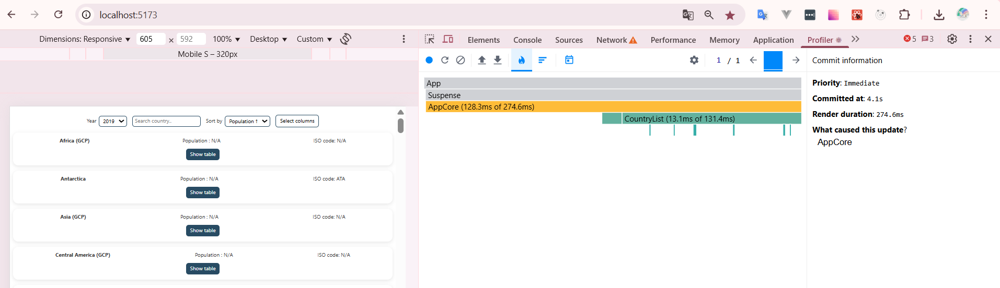

#### Ranked Chart

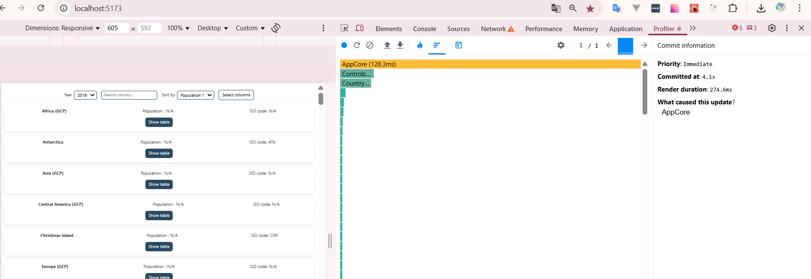

- Search:

#### Flame Graph

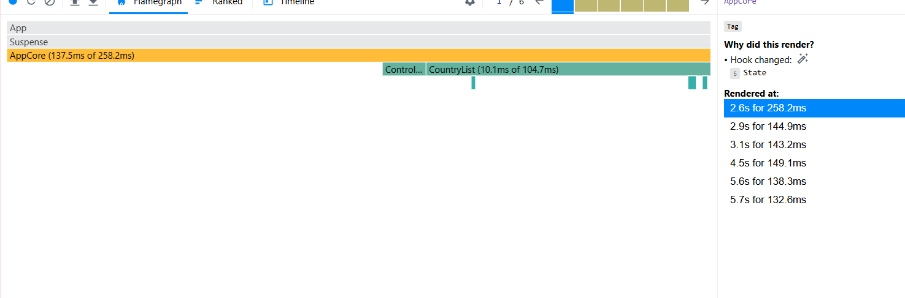

#### Ranked Chart

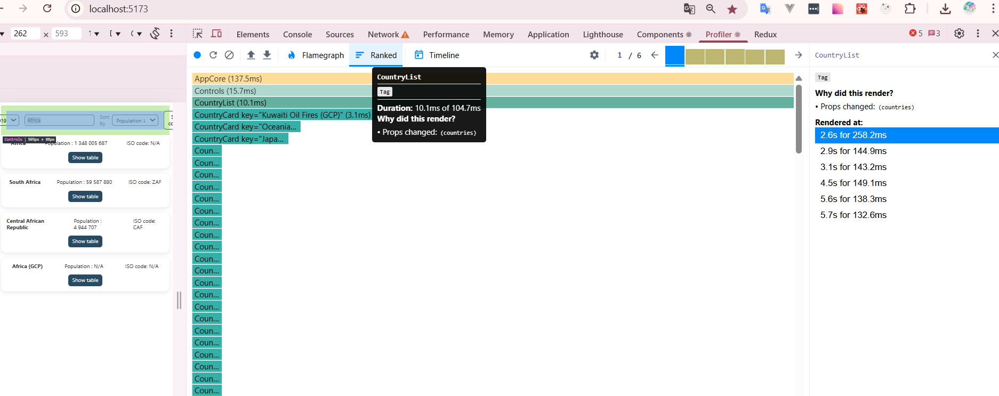

- Year selection:

#### Flame Graph

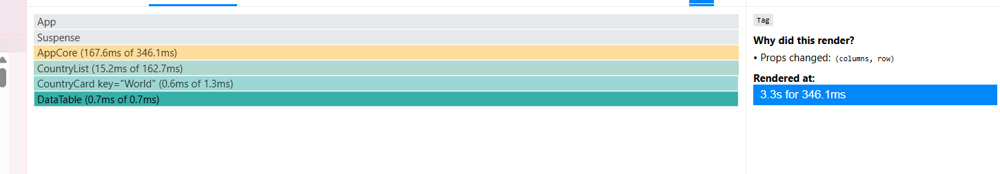

#### Ranked Chart

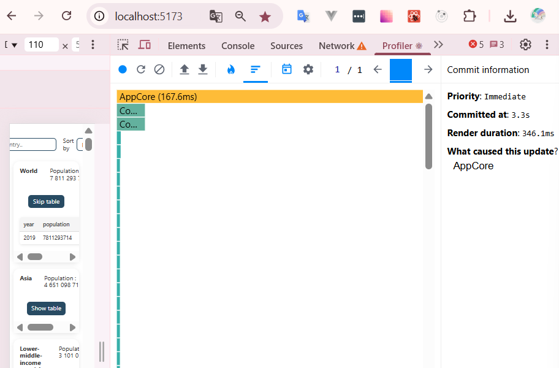

- Columns

#### Flame Graph

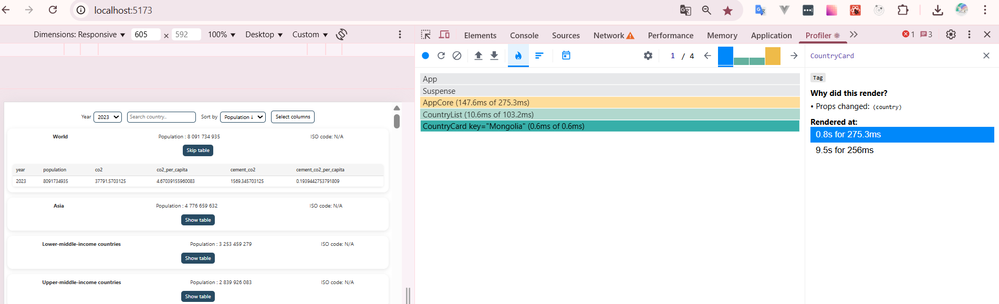

#### Ranked Chart

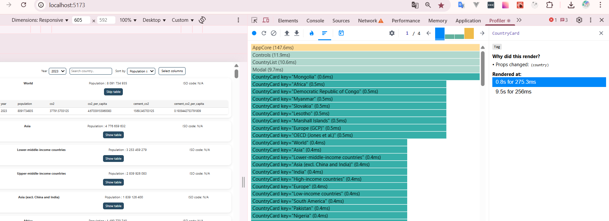

## Optimizations

- `React.memo` for: `Controls`, `CountryCard`, `CountryList`, `DataTable`
- `useMemo` for: filtering/sorting, country search, year selection
- `useCallback` for: `handleOpenModal`, `handleCloseModal`,`handleYearChange`,`handleCountryChange`,`handleSortChange`,`handleColumnsChange`

---

## After optimizations

| Script         | Commit duration (ms) | Δ vs Before | Top components by Render duration                 | Commits |
| -------------- | -------------------: | ----------: | ------------------------------------------------- | ------: |
| Sort           |               `78.8` |    `-71.3%` | `AppCore`, `Controls`, `CountryList`              |    `1'` |
| Search         |      `3.8s for 44.9` |   `-66.14%` | `AppCore`, `Controls`, `CountryList`              |    `6'` |
| Year selection |              `225.1` |   `-34.96%` | `AppCore`, `Controls `, `CountryCard`,`DataTable` |    `1'` |
| Columns        |      `0.6s for 27.9` |   `-89.86%` | `AppCore`,`Modal`                                 |    `4'` |

---

## After optimizations screenshots

- Sort:

#### Flame Graph

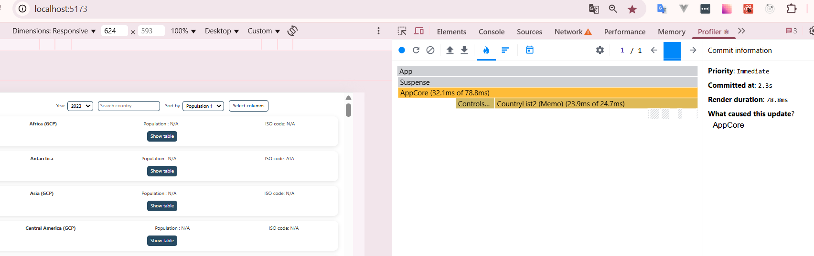

#### Ranked Chart

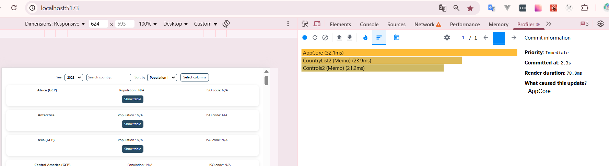

- Search:

#### Flame Graph

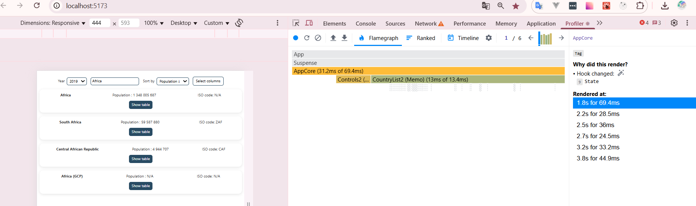

#### Ranked Chart

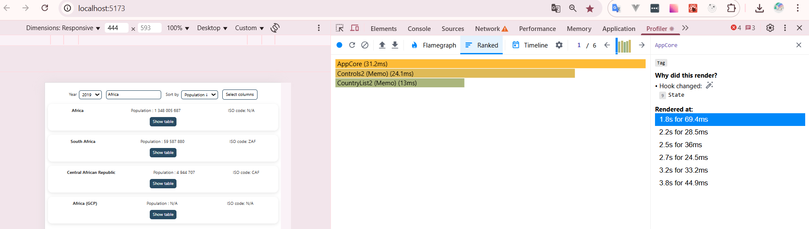

- Year selection:

#### Flame Graph

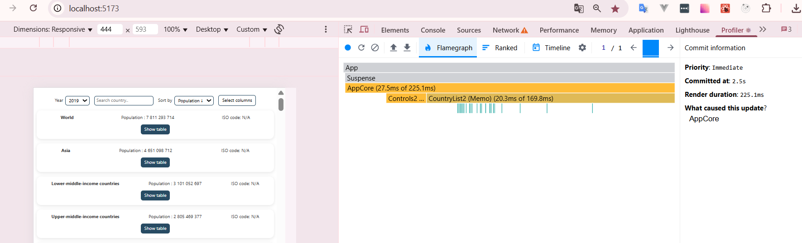

#### Ranked Chart

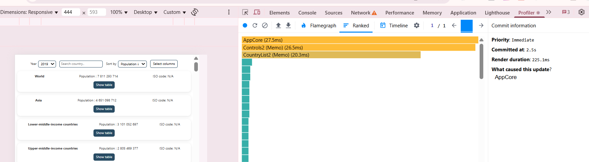

- Columns

#### Flame Graph

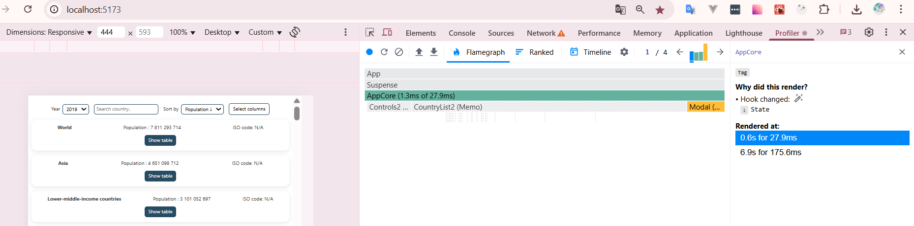

#### Ranked Chart

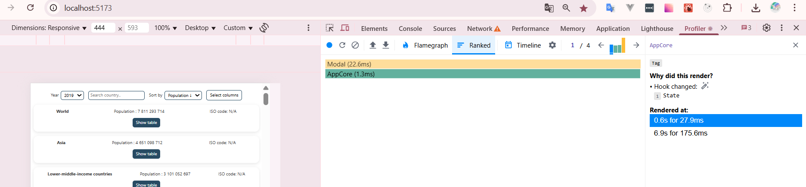
